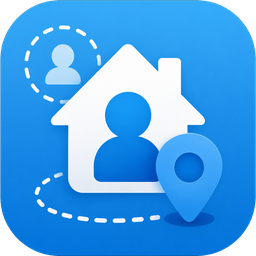

# Presence Simulator



A Home Assistant custom integration that **learns** how your home normally uses
lights and energy over the week, then replays a **realistic, randomized**
version of that activity while you're away — so anyone watching the house can't
tell it's empty.

## What it does

1. **Learns** – every 5 minutes it samples the entities you tell it to *monitor*
   (lights, switches, power/energy sensors, media players, …) and builds a
   per-entity, per-time-of-week probability model (the chance each thing is
   "active" in each 30-minute slot, for each day of the week). Power/energy
   sensors count as "active" above a configurable wattage threshold.
2. **Simulates** – when away mode is on, every time slot it decides which of
   your *controlled* entities (lights, switches, …) to turn on/off, drawn from
   the learned probabilities but with deliberate randomness so the pattern never
   repeats identically day to day:
   - probabilistic on/off per slot (not a fixed replay),
   - a chance to deviate from the learned habit (`randomness`),
   - random timing *jitter* within each slot so changes don't all happen on the
     clock tick,
   - a minimum *dwell* time so lights don't flicker,
   - a cap on how many controlled entities are on at once,
   - quiet overnight hours where almost everything stays off.
   - Controlled entities you never monitored fall back to your home's overall
     activity profile.

   When away mode turns off, anything the simulator switched on is turned back
   off so you don't come home to a lit-up house.

## Install

**Via HACS (recommended):** HACS → ⋮ → *Custom repositories* → add this repo's
URL with category **Integration** → install **Presence Simulator** → restart
Home Assistant.

**Manually:** copy `custom_components/presence_simulator/` into your Home
Assistant `config/custom_components/` folder and restart HA.

Then **Settings → Devices & Services → Add Integration → Presence Simulator**.

## Configure (all in the UI)

Setup is a **single page**: pick the entities to *control* while away (and
optionally extra things to learn from), then the two *learning* settings —
**Schedule resolution** and the **Power 'active' threshold**. Sensible defaults
are provided. Anything you *control* is automatically learned from too, so you
never have to list the same entity twice.

The day-to-day **tuning controls** are live entities on the device page (see
below), not wizard fields — adjust them anytime without disturbing learned data.
Re-open **Configure** for a *"What do the tuning controls do?"* explainer page.

### What each control does

| Control | Where | What it does |
| --- | --- | --- |
| **Schedule resolution** | Configure | How finely the week is divided when learning/replaying (e.g. 30-min blocks). Smaller = more detailed, slower to learn. Changing it starts a *separate* model for the new resolution; the old one is kept and restored if you switch back. |
| **Power 'active' threshold** | Configure | For power/energy sensors, the watts above which a device counts as "in use" while learning. |
| **Routine variation** | Device page | How often the house breaks its learned routine. 0% = faithful replay; higher = more surprises. Default 15%. |
| **Minimum time between changes** | Device page | Shortest time a device holds its new state before changing again; stops flicker. Default 20 min. |
| **Switch timing jitter** | Device page | Each change is nudged by a random delay up to this many minutes, so switches don't all happen on the clock tick. Default 7 min. |
| **Max devices on at once** | Device page | Cap on how much of the house is lit at the same time, as a share of controlled devices. Default 85%. |
| **Quiet hours start / end** | Device page | Overnight window kept mostly dark (the odd light may still come on). |

## Entities created

- `switch.presence_simulator_away_simulation` – turn on to start simulating.
- `sensor.presence_simulator_learning_coverage` – % of the weekly schedule
  observed at least once (let it run ~1 week for full coverage).
- `sensor.presence_simulator_observations` – total samples collected.

Live **tuning controls** (device page → *Configuration*), changeable anytime:

- `number.presence_simulator_routine_variation`
- `number.presence_simulator_minimum_time_between_changes`
- `number.presence_simulator_switch_timing_jitter`
- `number.presence_simulator_max_devices_on_at_once`
- `time.presence_simulator_quiet_hours_start`
- `time.presence_simulator_quiet_hours_end`

## Services

- `presence_simulator.reset_model` – wipe learned history.
- `presence_simulator.run_step` – force a simulation step now (for testing).
- `presence_simulator.export_model` – returns a model summary (response data).

## Example away-mode automation

Let it learn for at least a few days first. Then flip the switch based on
presence — e.g. when everyone leaves:

```yaml
alias: Presence Simulator - follow occupancy
trigger:
  - platform: state
    entity_id: group.family   # or zone.home person count, alarm armed_away, etc.
    to: "not_home"
    for: "00:10:00"
  - platform: state
    entity_id: group.family
    to: "home"
action:
  - service: "switch.turn_{{ 'on' if trigger.to_state.state == 'not_home' else 'off' }}"
    target:
      entity_id: switch.presence_simulator_away_simulation
mode: single
```

Or tie it to your alarm: turn the switch on when armed `away`, off when
disarmed.

## Notes

- The model is persisted, so it survives restarts and keeps improving.
- Changing the slot size resets the model (bucket layout changes).
- This is a deterrent, not a guarantee; combine with other security measures.
